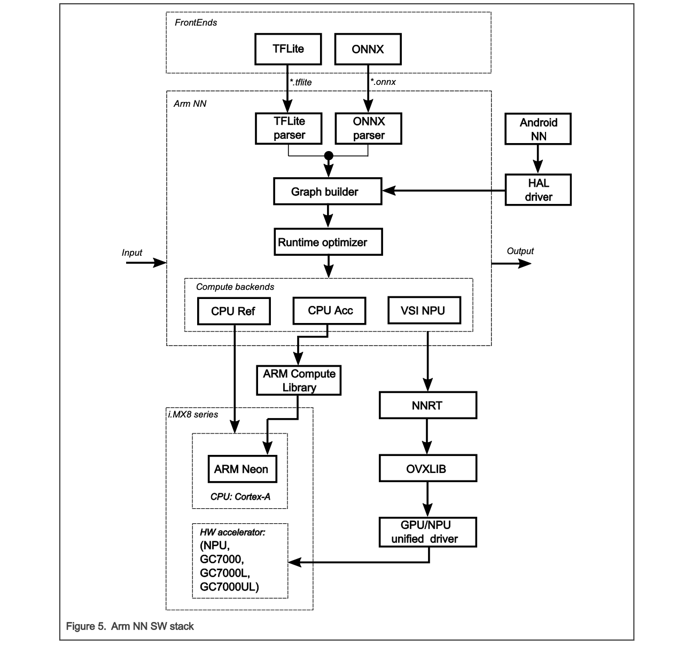

# i.MX8 Plus firmware

The github actions will build the firmware based on pushes to `hw/imx8`.

* Attempt to build the iMX firmware. If successful artifacts will be uploaded.
* If successful(with artifacts an) the commit has tag starting with `r` create a release with the artifacts and the release_name using the tag

https://trstringer.com/github-actions-create-release-upload-artifacts/

Although somewhat outdated the `hw/rockchip` branch can be used for inspiration.

Compute Engine Structure on i.MX 8M

- **For the CPU:** there is the NEON backend, which uses Arm Compute Library with the Arm NEON SIMD extension. 
- **For the GPUs and NPUs:** NXP provides the VSI NPU backend, which leverages the full capabilities of i.MX 8's GPUs/ NPUs using OpenVX and provides a great performance boost. ACL OpenCL backend, which you might notice in the source codes, is not supported due to Arm NN OpenCL requirements not being fulfilled by the i.MX 8 GPUs.
 
