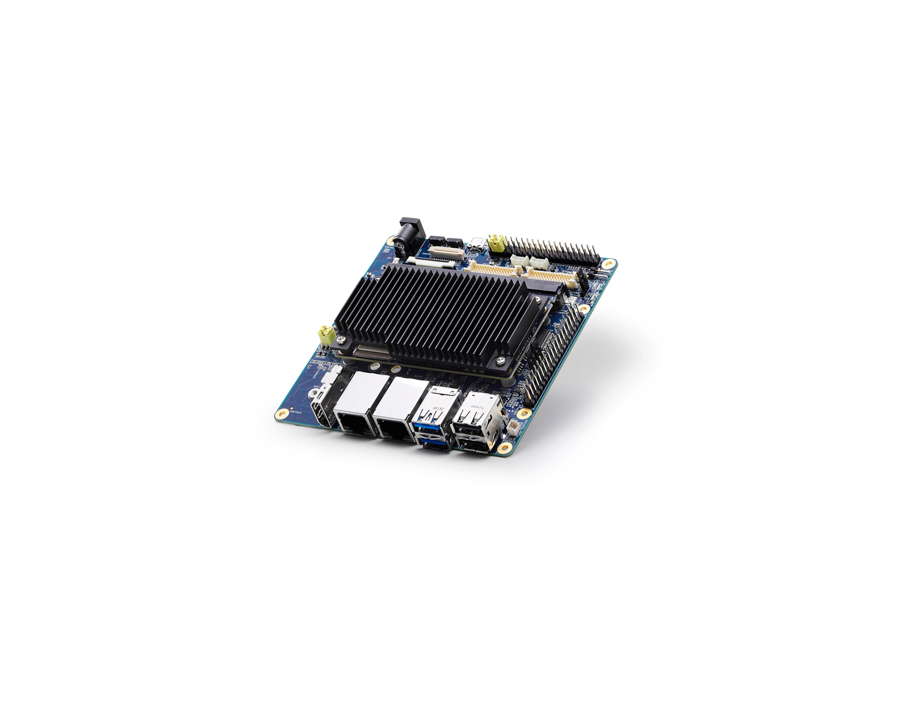

# i.MX8 Plus

This is concerned with getting up and running on two carrier boards and later on our own.

- [SB-UCM-iMX8PLUS](https://www.compulab.com/products/carrier-boards/sb-ucmimx8plus-carrier-board/#diagram).
- [I-Pi_SMARC-IMX8M-PLUS](https://www.ipi.wiki/pages/imx8mp-docs)
- [SMARC Modules](https://sget.org/standards/)
- 

Source code and build scripts are found under [device/imx8](./device/imx8/README.md)




## I-Pi_SMARC-IMX8M-PLUS Build

The board build runs within `imx-yocto-bsp` based on https://github.com/ADLINK/adlink-manifest. See [build instructions](https://www.ipi.wiki/pages/imx8mp-docs?page=HowToBuildYocto.html).

Run the following command on your host system to provoke the yocto image building process.

> $ bitbake imx-image-full

After the build is complete, disk images will be located at work-dir/build-dir/tmp/deploy/image/lec-imx8mp/

The build should generate the following firmware `imx-image-full-lec-imx8mp.wic.bz2`.
This has the file system image (without bootloader). 
The twin file ending in `.tar.bz2` holds the file system tree.

Boot pins,

- SD Card 0110
- eMMC 1000
- Recovery 0001


## Flashing Firmware

The easy approach is to burn the image to an SD Card. Use,

- balena Etcher
- `dd`
- rufus

Otherwise put board in recovery mode to flash eMMC with `mfgtool`/`uuu`.

- [Flash Yocto or Android Image to eMMC](https://docs.ipi.wiki/SMARC/ipi-smarc-imx8mp/HowToFlashImageeMMC.html#Flash-Yocto-or-Android-Image)
- 


Install mfgtool

```
git clone https://github.com/NXPmicro/mfgtools.git
cd mfgtools
sudo apt-get install libusb-1.0-0-dev libbz2-dev zlib1g-dev libzstd-dev pkg-config cmake libssl-dev g++
cmake . && make
```


## Notes to integrate

The I-Pi board has 4 dip switches on the board hidden near the Ethernet connectors. Use 1000 for eMMC / 0110 for SD booting.

